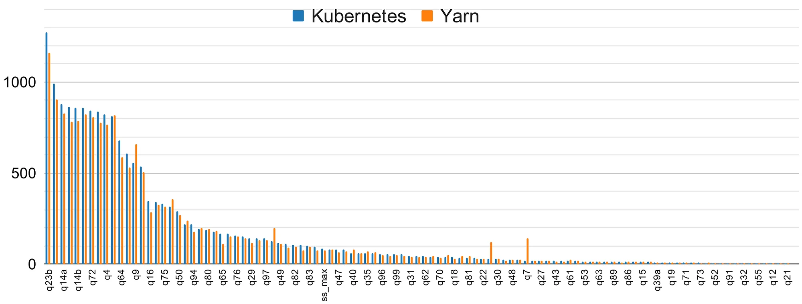
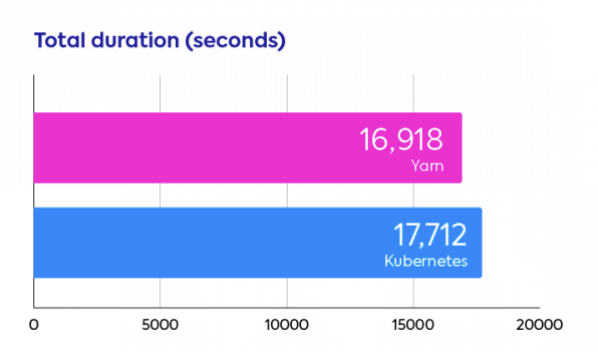

# Сравнение производительности ML на Spark Kubernetes и Spark YARN

Ссылка на видео доклада: https://drive.google.com/file/d/17pIqhMX9jjZg9YCTYmriquFbSvm1TjRP/view?usp=sharing

Ссылка на презентацию к докладу: https://docs.google.com/presentation/d/1pe_aopQRkJQ-oZLydY_ri0WUVRRpGsT7GxumhfknPgk/edit?usp=sharing

## Вступление

Apache Spark - это фреймворк с открытым исходным кодом, предназначенный для распределенных вычислений. Это отличный инструмент для работы с большими объемами данных, но он не способен управлять кластером машин, на которых запущен. Для этого требуется планировщик. К таким относятся Apache Hadoop YARN и Kubernetes, на котором поддержка запуска Spark была добавлена в версии 2.3, и с тех пор внедрение Spark на k8s ускоряется.

В этом докладе я расскажу про бенчмаркинговый анализ производительности Kubernetes и Hadoop YARN, проведенный в июле 2020 года. Спойлер: результаты показывают, что Kubernetes догнал Yarn — между ними больше нет существенных различий в производительности.

## TPC-DS benchmark

Исследование проводилось по типовому TPC-DS (TPC Benchmark Decision Support) протоколу, поскольку это один из самых популярных тестов для Apache Spark и распределенных вычислений в целом. Он включает оценку следующих параметров:

- время ответа на запрос в однопользовательском режиме;
- пропускная способность запросов в многопользовательском режиме;
- производительность обслуживания данных для данного оборудования, операционной системы и конфигурации системы обработки данных при контролируемой, сложной и многопользовательской рабочей нагрузке.

Тест TPC-DS состоит из двух компонентов: данных и запросов.

- В нашем случае данные являются синтетическими и неравномерными. Это означает, что некоторые части намного больше, чем другие. Такой подход позволит отразить реальные ситуации (например, в июле было гораздо больше продаж, чем в январе). Для теста был собран набор данных объемом 1 ТБ.

- SQL-запросы были написаны так, чтобы покрыть большинство случаев для среднестатистической розничной компании. В результате запросы предъявляют разные требования к ресурсам: некоторые из них требуют высокой нагрузки на процессор, в то время как другие требуют больших затрат на ввод-вывод.

Производительность платформы распределенных вычислений является многомерной: следует учитывать стоимость и длительность выполнения. Например, что лучше между запросом, который длится 10 часов и стоит 10 долларов, и запросом продолжительностью 1 час за 200 долларов? Это зависит от потребностей вашей компании.

В этом тесте у нас есть фиксированный объем ресурсов для Yarn и Kubernetes. В результате стоимость запроса прямо пропорциональна его продолжительности. Это позволяет нам сравнить два планировщика по одному параметру: продолжительности.

## Результаты

На графике ниже показана производительность всех запросов TPC-DS для Kubernetes и Yarn. В целом, они показывают очень схожую производительность. Почти по всем запросам запросы Kubernetes и YARN заканчиваются в диапазоне +/-10% друг от друга. Визуально это выглядит так, как будто YARN одерживает победу с небольшим отрывом.

Обобщенные результаты подтверждают эту тенденцию. Общая продолжительность выполнения теста с использованием двух планировщиков очень близка друг к другу, с преимуществом YARN в 4,5%.

## Вывод

Поскольку каждый запрос выполнялся  всего 5 раз, разница в 5% не является статистически значимой. Эта разница нивелируется достоинствами K8s, а также с помощью оптимизации настроек Spark, таких, как количество разделов, управление памятью, структуры для перемешивания данных (shuffle), используемые при операциях аналитики Big Data (группировка, агрегация и join-соединение).

## Источники

1. https://spot.io/blog/apache-spark-performance-benchmarks-show-kubernetes-has-caught-up-with-yarn/

2. https://medium.com/@bigdataschool/когда-и-зачем-нужен-apache-spark-на-kubernetes-варианты-использования-и-преимущества-d6cbc23eb089

3. https://www.sobyte.net/post/2022-03/spark-on-kubernetes-or-yarn/
